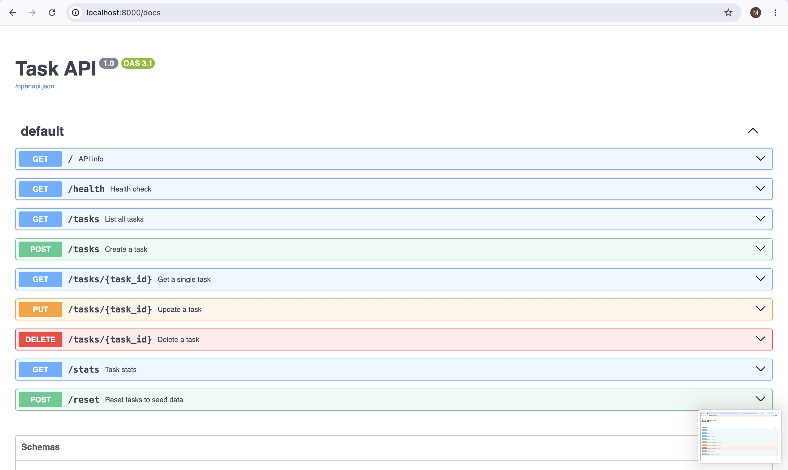
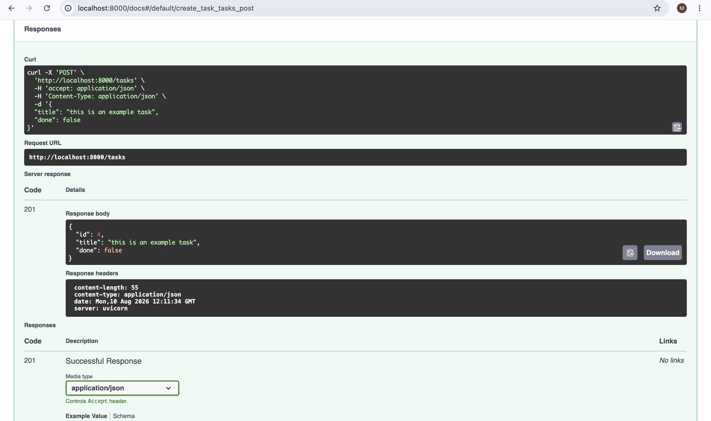

# Task API

A small CRUD API for managing a to-do list, built with FastAPI. Data is stored in memory only and resets whenever the server restarts.

## What this is
Five endpoints implementing full CRUD (Create, Read, Update, Delete) on an in-memory list of tasks, plus a couple of small extras (filtering, search, stats, reset). Built as part of the Backend AI Engineering track, Week 2, Assignment 1.

## How to install & run

```bash
python3 -m venv venv
source venv/bin/activate
pip install -r requirements.txt
uvicorn main:app --reload --port 8000
```

Then open http://localhost:8000/docs for Swagger UI, or hit the API directly with curl.

## Endpoints
| Method | Path | Description | Success | Errors |
|---|---|---|---|---|
| GET | `/` | API info | 200 | — |
| GET | `/health` | Health check | 200 | — |
| GET | `/tasks` | List all tasks (optional `?done=` and `?search=` filters) | 200 | — |
| GET | `/tasks/{id}` | Get one task | 200 | 404 if not found |
| POST | `/tasks` | Create a task (`{"title": "..."}`) | 201 | 400 if title missing/empty |
| PUT | `/tasks/{id}` | Update a task's title and/or done | 200 | 400 invalid body, 404 unknown id |
| DELETE | `/tasks/{id}` | Delete a task | 204 | 404 if not found |
| GET | `/stats` | Task counts (`total`, `done`, `open`) | 200 | — |
| POST | `/reset` | Reset tasks to the 3 seed tasks | 200 | — |

## Example: curl -i output
```
$ curl -i -X POST http://localhost:8000/tasks -H "Content-Type: application/json" -d '{"title":"Buy milk"}'
HTTP/1.1 201 Created
content-type: application/json

{"id":4,"title":"Buy milk","done":false}
```

## Swagger UI
Full CRUD cycle tested via "Try it out" at `/docs`.





Tasks created during a session disappear the moment the server restarts: `GET /tasks` comes back with only the 3 seed tasks again. That's because everything lives in a Python list in process memory: when the process dies, so does the list.
