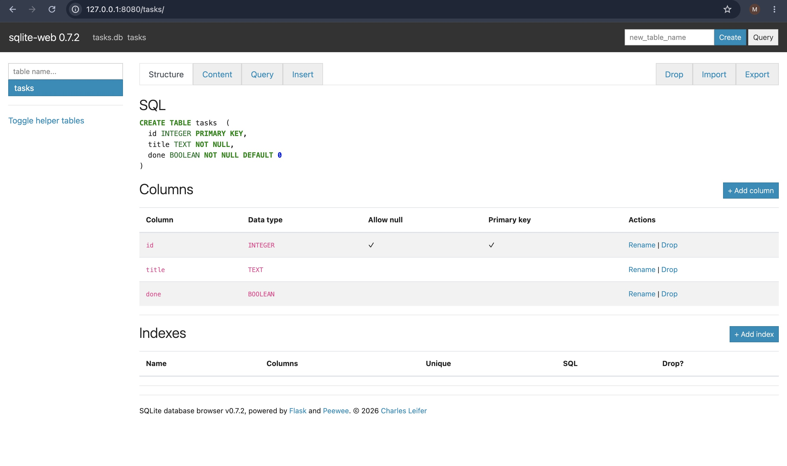
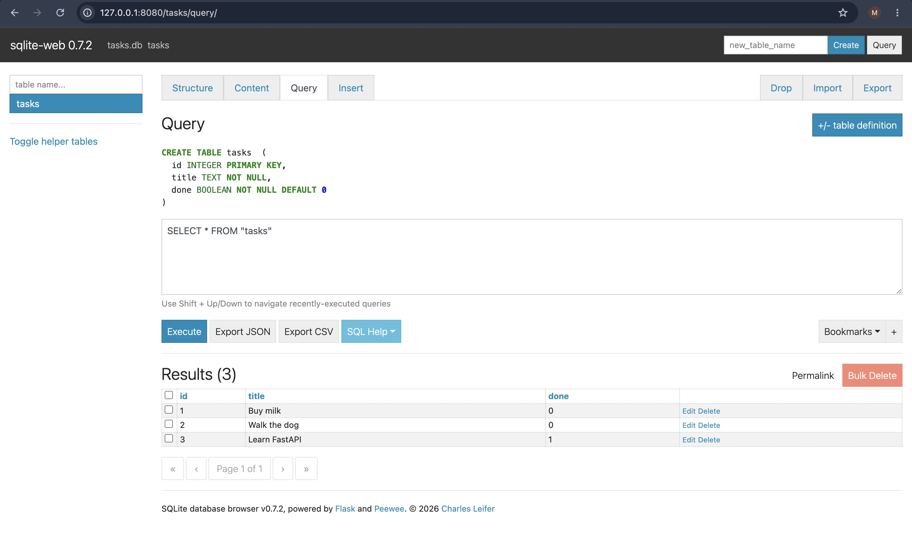

# Task API
A small CRUD API for managing a to-do list, built with FastAPI. Data is stored in a SQLite database (`tasks.db`), so it survives server restarts.

## What this is
Five endpoints implementing full CRUD (Create, Read, Update, Delete) on a `tasks` table, plus a couple of small extras (filtering, search, stats, reset). Built as part of the Backend AI Engineering track, Week 3.

## Why SQLite
SQLite needs no separate database server, no connection string, and no install step beyond Python's own standard library (`sqlite3`): the entire database is one file. That makes it a good fit for a small single-service project like this one: anyone who clones the repo and runs the app gets a working, persistent database with zero extra setup, and the file can be inspected directly with any SQLite browser.

## Where the database lives
`tasks.db`, created next to `main.py`/`db.py` in this directory (see `DB_PATH` in [db.py](db.py)). It's gitignored, so it isn't committed. Every clone generates its own copy the first time the app starts.

## How to install & run
```bash
python3 -m venv venv
source venv/bin/activate
pip install -r requirements.txt
uvicorn main:app --reload --port 8000
```

On startup, `init_db()` (in `db.py`) automatically creates the `tasks` table if it doesn't exist yet, and seeds it with 3 example tasks the first time only (if the table is empty). No manual database setup is required .

Then open http://localhost:8000/docs for Swagger UI, or hit the API directly with curl.

## Endpoints
| Method | Path | Description | Success | Errors |
|---|---|---|---|---|
| GET | `/` | API info | 200 | — |
| GET | `/health` | Health check | 200 | — |
| GET | `/tasks` | List all tasks (optional `?done=` and `?search=` filters) | 200 | — |
| GET | `/tasks/{id}` | Get one task | 200 | 404 if not found |
| POST | `/tasks` | Create a task (`{"title": "..."}`) | 201 | 400 if title missing/empty |
| PUT | `/tasks/{id}` | Update a task's title and/or done | 200 | 400 invalid body, 404 unknown id |
| DELETE | `/tasks/{id}` | Delete a task | 204 | 404 if not found |
| GET | `/stats` | Task counts (`total`, `done`, `open`) | 200 | — |
| POST | `/reset` | Reset tasks to the 3 seed tasks | 200 | — |

## Example: curl -i output
```
$ curl -i -X POST http://localhost:8000/tasks -H "Content-Type: application/json" -d '{"title":"Buy milk"}'
HTTP/1.1 201 Created
content-type: application/json

{"id":4,"title":"Buy milk","done":false}
```

## Database viewer
`tasks.db` can be inspected with any SQLite browser (e.g. [DB Browser for SQLite](https://sqlitebrowser.org/), or the browser-based [sqlite-web](https://github.com/coleifer/sqlite-web) shown below. Run with `sqlite_web tasks.db`).



## Example SQL query
Run directly against `tasks.db` via sqlite-web's Query tab while the API is running. Changes show up immediately in `GET /tasks`, since every request opens a fresh connection to the same file rather than caching data in memory:

```sql
SELECT * FROM "tasks"
```



## Persistence
Tasks created during a session now survive a server restart. `GET /tasks` still returns them after stopping and restarting `uvicorn`, because they live in `tasks.db` on disk rather than in a Python list in process memory.
