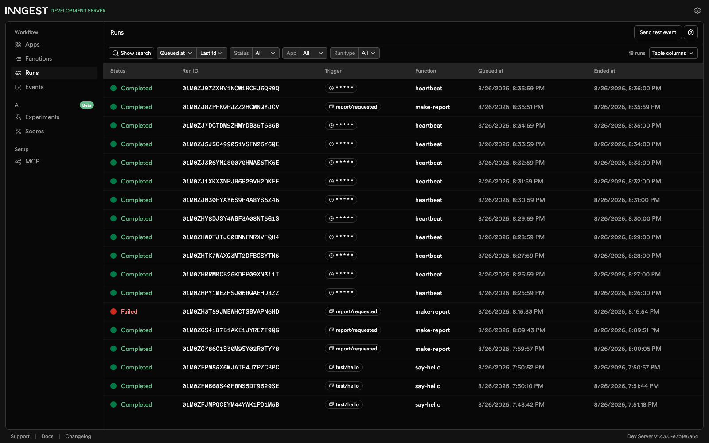

# Week 7 (bg): Job System

## What this is
A FastAPI app that hands slow work off to Inngest instead of making the caller wait for it. `POST /reports` accepts a job and
returns immediately (`202`); a background function does the actual work and
a status endpoint lets the caller poll for the result. Built in stages: a
plain health check, an Inngest-connected worker, the accept-now/work-later
pattern, retries with backoff, and a cron heartbeat.

## Running Locally
Two terminals: your API and the Inngest Dev Server:

```bash
# terminal 1: the API
source venv/bin/activate
uvicorn main:app --port 8000
```

```bash
# terminal 2: the Dev Server
npx inngest-cli@latest dev -u http://localhost:8000/api/inngest
```

Dashboard: http://localhost:8288

## Endpoints
| Method | Path            | Body               | Success | Errors                          |
|--------|-----------------|--------------------|---------|----------------------------------|
| GET    | `/health`       | —                  | `200` `{"status":"ok"}` | — |
| POST   | `/reports`      | `{"topic": "cats"}` | `202` `{"id","status":"pending"}` | `400` if `topic` is missing/empty |
| GET    | `/reports/{id}` | —                  | `200` the saved report (`pending` -> `done` + `result`) | `404` unknown id |

## Functions
| Function     | Trigger                        | What it does |
|--------------|---------------------------------|---------------|
| `say-hello`  | event `test/hello`              | Sleeps 5s, returns `"Hello from the background!"` |
| `make-report`| event `report/requested`, `retries=2` | Sleeps 8s, then builds the report and marks it `done`. Raises if `topic == "fail"`, so that run retries up to 3 attempts before ending `Failed` |
| `heartbeat`  | cron `* * * * *`                | Every minute, counts `reports` by status and logs/returns `"heartbeat: N pending, N done, N failed"` |

## Proof: accept now, work later
```
$ curl -i -X POST http://localhost:8000/reports -H "Content-Type: application/json" -d '{"topic":"cats"}'
HTTP/1.1 202 Accepted
content-type: application/json

{"id":"eefd962f-5c85-4f0d-a3f9-eddfc052272d","status":"pending"}

$ curl -i http://localhost:8000/reports/eefd962f-5c85-4f0d-a3f9-eddfc052272d
HTTP/1.1 200 OK
content-type: application/json

{"id":"eefd962f-5c85-4f0d-a3f9-eddfc052272d","topic":"cats","status":"pending"}

$ # ~10s later
$ curl -i http://localhost:8000/reports/eefd962f-5c85-4f0d-a3f9-eddfc052272d
HTTP/1.1 200 OK
content-type: application/json

{"id":"eefd962f-5c85-4f0d-a3f9-eddfc052272d","topic":"cats","status":"done","result":"Report on 'cats': this is a stand-in for a real result."}
```

## Stage 3: Watch the retry
A missing `topic` is wrong no matter when you send it, so it's rejected at
the door (`400`, no report, no event, no run); a broken oven might work if
you just try again a moment later, so it's worth a retry. `make-report`
runs attempt 1 → backoff → attempt 2 → backoff → attempt 3 → `Failed`
before giving up.

## Stage 4: The clock knocks
Every day at 08:00: `0 8 * * *`. Every Sunday at 22:00: `0 22 * * 0` (built
on crontab.guru; servers run cron in UTC, so check the timezone before
trusting either).

Caveat: `failed` always reads `0` for now — `make-report` never sets
`status: "failed"` after exhausting retries, it just stays `pending`
forever.

## Dashboard
`say-hello`, `make-report` (including one `Failed` run from the retry
test), and `heartbeat` ticking every minute:


