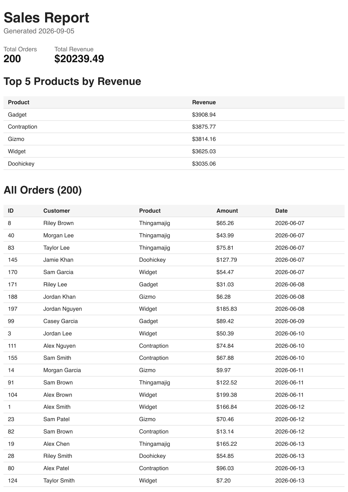

# PDF Report Generator

## What This Is
A FastAPI app that turns rows in a SQLite database into a downloadable PDF report: query the data, render it to HTML, print that HTML to a PDF with headless Chromium (Playwright), and hand back a link. Built in stages: a health check, a seeded `orders` table, aggregate SQL queries, an HTML/PDF renderer, endpoints to generate/look up/download a report, and a per-day idempotency check on generation.

## Dataset
Shop: an `orders` table (`id`, `customer`, `product`, `amount`, `created_at`), seeded with ~200 random orders across 6 products.

## How To Run
```bash
source venv/bin/activate
python init_db.py      # creates report.db (orders, reports tables)
python seed.py         # inserts 200 random orders (safe to re-run — clears first)
uvicorn main:app --port 8000
```

## Endpoints
| Method | Path                  | Body | Success | Errors |
|--------|-----------------------|------|---------|--------|
| GET    | `/health`             | —    | `200` `{"status":"ok"}` | — |
| POST   | `/reports`            | `{"force": bool}` optional | `201` `{"id","file"}` on a new render, `200` with the existing id if one was already made today | — |
| GET    | `/reports/{id}`       | —    | `200` the bookkeeping row + file link | `404` unknown id |
| GET    | `/reports/{id}/file`  | —    | `200` the PDF file | `404` unknown id |

## Aggregation SQL
From `report.py`, `get_report_data()`:
```sql
-- total orders
SELECT COUNT(*) AS n FROM orders;

-- total revenue
SELECT SUM(amount) AS total FROM orders;

-- top 5 products by revenue
SELECT product, SUM(amount) AS revenue
FROM orders
GROUP BY product
ORDER BY revenue DESC
LIMIT 5;

-- orders per day, last 7 days
SELECT created_at, COUNT(*) AS n
FROM orders
WHERE created_at >= date('now', '-6 days')
GROUP BY created_at;
```

## Proof: Generate, Download, Idempotency
```
$ time curl -i -X POST http://localhost:8000/reports
HTTP/1.1 201 Created
{"id":1,"file":"/reports/1/file"}

$ curl -i -X POST http://localhost:8000/reports        # fired right back-to-back
HTTP/1.1 200 OK
{"id":1,"file":"/reports/1/file"}                      # same id, no new file

$ curl -i -X POST http://localhost:8000/reports -d '{"force": true}'
HTTP/1.1 201 Created
{"id":2,"file":"/reports/2/file"}                      # force skips the check -> new id

$ curl -o my-report.pdf http://localhost:8000/reports/1/file
$ file my-report.pdf
my-report.pdf: PDF document, version 1.4, 6 pages
```
`reports/` gained exactly one new file per genuinely new id (`1.pdf`, then `2.pdf` from the forced call), the repeated plain POST created nothing.

## Report Contents
The report aggregates total order count, total revenue, top 5 products by revenue, and orders per day for the last 7 days, then renders that alongside a full 200-row order dump into an HTML template printed to PDF. The long orders table uses `tr { break-inside: avoid; }` and a real `<thead>` so rows don't get sliced across a page break and the header repeats on every page.

## On Background Jobs
I'd move report generation out of the request and into a background job (accept-now/work-later, as in `week7-bg`) once a single render regularly exceeds ~1-2s or the endpoint needs to serve more than one concurrent user, since a multi-second synchronous request ties up a worker thread and leaves every caller behind it waiting.

## On Idempotency
The daily check protects against duplicate work from retries, double-clicks, or a flaky client that resends a request it never got a response for, so the same intent doesn't silently multiply into extra files and rows. A missing check like this is exactly how a payment-processing job or a "send invoice" endpoint ends up emailing a customer the same bill twice, or a reconciliation script double-charges a card because a timeout made the caller retry a request that had actually already succeeded.

## Screenshot: Report PDF, Page 1

